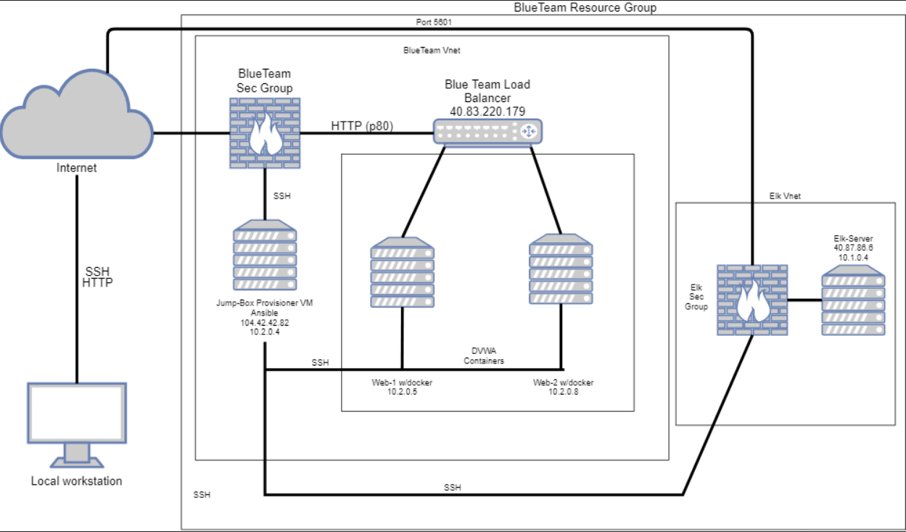

## Automated ELK Stack Deployment

The files in this repository were used to configure the network depicted below.

These files have been tested and used to generate a live ELK deployment on Azure. They can be used to either recreate the entire deployment pictured above. Alternatively, select portions of the Read me file may be used to install only certain pieces of it, such as Filebeat.

This document contains the following details:
- Description of the Topology
- Access Policies
- ELK Configuration
  - Beats in Use
  - Machines Being Monitored
- How to Use the Ansible Build

### Description of the Topology

The main purpose of this network is to expose a load-balanced and monitored instance of DVWA, the D*mn Vulnerable Web Application.

Load balancing ensures that the application will be highly available, in addition to restricting inbound access to the network.
The load balancer ensures that work to process incoming traffic will be shared by both vulnerable web servers. 
Access controls ensure that only authorized users will be able to connect in the first place.

Integrating an ELK server allows users to easily monitor the vulnerable VMs for changes to the file systems of the VMs on the network, and system metrics.
Filebeat monitors logfiles.
Metricbeat records the metrics of your server.

The configuration details of each machine may be found below.

| Name     | Function | IP Address | Operating System |
|----------|----------|------------|------------------|
| Jump Box | Gateway  | 10.2.0.4   | Linux            |
|  Web-1   |Web Server| 10.2.0.5   | Linux            |
|  Web-2   |Web Server| 10.2.0.6   | Linux            |
|   ELK    |Monitoring| 10.1.0.4   | Linux            |

### Access Policies

The machines on the internal network are not exposed to the public Internet. 

Only the jump box machine can accept connections from the Internet. Access to this machine is only allowed from the following IP addresses:
104.54.166.140

Machines within the network can only be accessed by each other.
The DVWA VMs send traffic to the ELK server

A summary of the access policies in place can be found in the table below.

| Name     | Publicly Accessible | Allowed IP Addresses |
|----------|---------------------|----------------------|
| Jump Box | Yes                 |    104.42.42.82      |
|  Web-1   | No                  |      10.2.0.5        |
|  Web-2   | No                  |      10.2.0.6        |
|   ELK    | No                  |      10.1.0.4        |

### Elk Configuration

Ansible was used to automate configuration of the ELK machine. No configuration was performed manually, which is advantageous because...
Automation with Ansible frees up time for IT professionals to do other, more important work.

The playbook implements the following tasks:
- Installs Docker.io
- Installs pip3
- Installs Docker Python Module
- Increases Memory for the use of ELK
- Installs and launches a docker elk container

The following screenshot displays the result of running `docker ps` after successfully configuring the ELK instance.

### Target Machines & Beats
This ELK server is configured to monitor the following machines:
- 10.2.0.5
- 10.2.0.6

We have installed the following Beats on these machines:
- Filebeat
- Metricbeat
- Packetbeat

These Beats allow us to collect the following information from each machine:
- Filebeat: Filebeat detects changes to the filesystems. Specifically, we use it to collect Apache logs.
- Metricbeat: Metricbeat detects changes in system metrics, like CPU usage. We use it to detect SSH login attempts, failed sudo escalations, and CPU/RAM statistics.
- Packetbeat: Packetbeat collects packets that pass through the NIC, similar to Wireshark. We use it to generate a trace of all activity that takes place on the network, in case later forensic analaysis is needed.

### Using the Playbook
In order to use the playbook, you will need to have an Ansible control node already configured. Assuming you have such a control node provisioned: 

SSH into the control node and follow the steps below:
- Copy the playbook file to the ansible control node.
- Update the hosts file to include what VMs you want it to run from
- Run the playbook, and navigate to Kibana address using the curl command and the ip to check that the installation worked as expected.

If all worked as intended you have now created an ELK server.